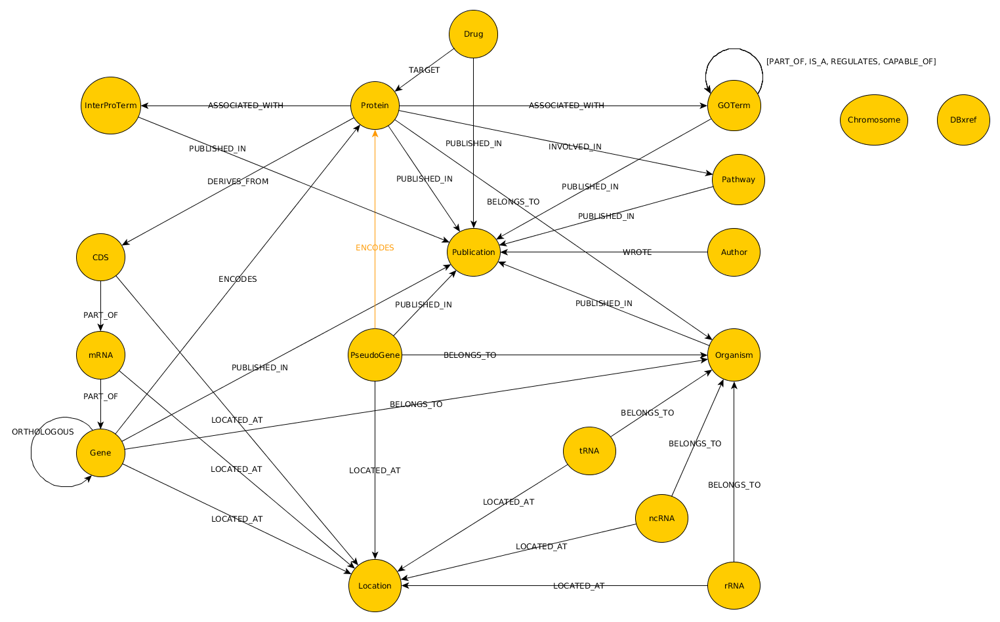

# Introduction

 

  

NeoDB is a free and open source integrated _M.tuberculosis (M.tb)_ ‘omics’ knowledge-base. NeoDB is based on Neo4j and enables researchers to execute complex federated queries by linking well-known, curated and widely used _M.tb_ data resources, and supplementary TB variants data from published literature. NeoDB was created by binding the labeled property graph model to a consensus-controlled ontology.

## Motivation

Recent advancements in genomic technologies have enabled high throughput cost-effective generation of sequence data from _M.tb_ isolates which is then shared via a number of heterogeneous publicly available databases. Albeit useful, fragmented curation negatively impacts the researcher’s ability to leverage the data via federated queries. This necessitates effective and efficient management, storage, analysis and visualization of the data and results through development of novel and customized bioinformatics software tools and databases.

## NeoDB Graph Model

