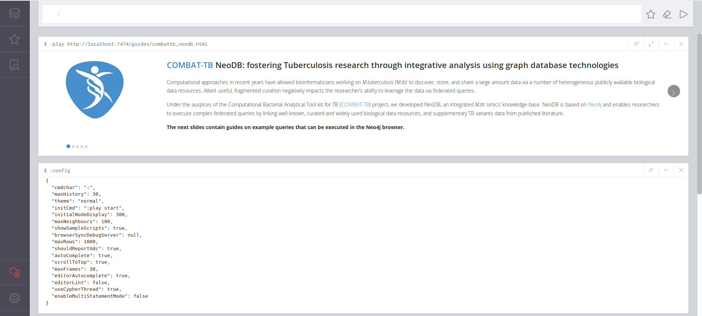

# Using docker

The fastest was to get a local installation is by using `docker` and `docker-compose`

**Prerequisites**

- [docker](https://www.docker.com/)
- [docker-compose](https://docs.docker.com/compose/overview/)

Assuming you have [docker](https://www.docker.com/) and [docker-compose](https://docs.docker.com/compose/overview/) installed.

```sh
$ git clone https://github.com/COMBAT-TB/combat-tb-db.git
$ cd combat-tb-db
$ docker-compose up --build -d
Building
```

The above command will build the combatTB NeoDB Graph database backed by Elasticsearch.

Once the server is running, visit [http://localhost:7474](http://0.0.0.0:7474). You shall see the following guide to get you familiar with the database.



## Standalone

Download and extract the latest release of Neo4j from the [Neo4j Download Center](https://neo4j.com/download-center/#releases) and follow the relevant installation instructions from the [operators manual](https://neo4j.com/docs/operations-manual/current/installation/).

`cd` into Neo4j directory:

```sh
$ cd ~/Downloads/neo4j-community-3.5.4
```

Download the NeoDB browser guide and configure Neo4j accordingly:

```sh
$ pwd
# $HOME/Downloads/neo4j-community-3.5.4
$ wget https://raw.githubusercontent.com/COMBAT-TB/combat-tb-db/master/guides/combattb_neodb.html \
-P guides/ \
&& echo 'dbms.security.auth_enabled=false' >> conf/neo4j.conf \
&& echo 'dbms.allow_upgrade=true' >> conf/neo4j.conf \
&& echo 'dbms.security.procedures.unrestricted=apoc.*,algo.*' >> conf/neo4j.conf \
&& echo 'dbms.security.procedures.whitelist=apoc.*, algo.*' >> conf/neo4j.conf \
&& echo 'dbms.unmanaged_extension_classes=extension.web=/guides' >> conf/neo4j.conf \
&& echo 'org.neo4j.server.guide.directory=guides' >> conf/neo4j.conf \
&& echo 'browser.post_connect_cmd=config; play http://localhost:7474/guides/combattb_neodb.html' >> conf/neo4j.conf \
&& echo 'browser.remote_content_hostname_whitelist=*' >> conf/neo4j.conf
```

Download and extract the [COMBAT-TB NeoDB](https://zenodo.org/record/1421060/files/gff2neo_db_data.tar.bz2?download=1):

```sh
$ pwd
# $HOME/Downloads/neo4j-community-3.5.4
$ wget "https://zenodo.org/record/1421060/files/gff2neo_db_data.tar.bz2" \
    -O gff2neo_db_data.tar.bz2
$ tar -xjvf gff2neo_db_data.tar.bz2
$ cp -R databases/ data/
```

Download the [APOC Procedures](https://github.com/neo4j-contrib/neo4j-apoc-procedures) and [Graph Algorithms](https://github.com/neo4j-contrib/neo4j-graph-algorithms) binary jars, and place then in the `$NEO4J_HOME/plugins` folder:

```sh
$ pwd
# $HOME/Downloads/neo4j-community-3.5.4
$ wget https://github.com/neo4j-contrib/neo4j-graph-algorithms/releases/download/3.4.12.7/graph-algorithms-algo-3.4.12.7.jar \
-P plugins/ \
&& wget https://github.com/neo4j-contrib/neo4j-apoc-procedures/releases/download/3.4.0.5/apoc-3.4.0.5-all.jar \
-P plugins/
```

Run Neo4j as a background process:

```sh
$ pwd
# $HOME/Downloads/neo4j-community-3.5.4
$ bin/neo4j start
```

and visit [http://localhost:7474](http://localhost:7474).
